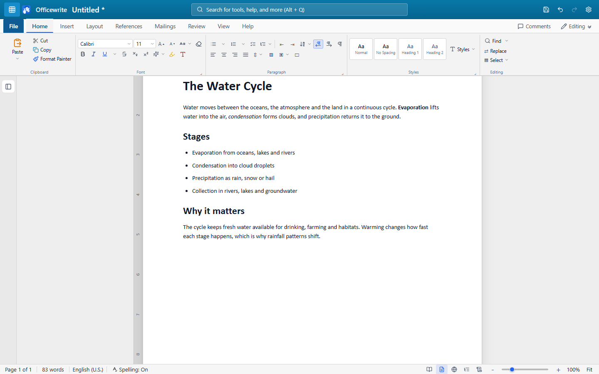

<p align="center">
  
</p>

<h1 align="center">Officewrite</h1>

<p align="center">
  <strong>A word processor that doesn't ask for your card.</strong><br />
  Free, open source, and yours to keep. A non-profit educational project.
</p>

<p align="center">
  <a href="https://officewrite.com/">Website</a> ·
  <a href="https://officewrite.com/app/">Use it in your browser</a> ·
  <a href="https://github.com/DandanITman/OfficeWrite/releases">Releases</a> ·
  <a href="docs/FEATURES.md">Features</a> ·
  <a href="CHANGELOG.md">Changelog</a> ·
  <a href="CONTRIBUTING.md">Contributing</a>
</p>

---

Officewrite is a free alternative to Microsoft Word, LibreOffice and OpenOffice. It writes essays,
letters, reports and CVs, with the ribbon, the styles and the `.docx` files you already know. It
runs on your own Windows PC, works offline, and costs nothing.

There is **no account, no cloud, and no telemetry.** Your documents stay on your machine, and the
app makes no network requests of its own.

<p align="center">
  
</p>

## Try it

This repository starts with a fresh source history. Windows installers will
appear on the [Releases page](https://github.com/DandanITman/OfficeWrite/releases)
when a release is published. The previous repository is preserved at
[OfficeWrite-Legacy2](https://github.com/DandanITman/OfficeWrite-Legacy2).

**Want to run the code?**

Install Node.js 22 or newer, then:

```bash
git clone https://github.com/DandanITman/OfficeWrite.git
cd OfficeWrite
npm ci
npm run dev
```

## What it can do

| | |
|---|---|
| **Write** | Fonts, colours and text effects · bullets, numbering, checklists and multilevel lists · tables you can size to the inch · pictures with drag handles and seven wrap modes · shapes, text boxes and freehand ink |
| **Structure** | A live styles gallery and style sets · a table of contents that keeps itself current · footnotes and endnotes · captions, cross-references and an index · citations in APA, MLA, Chicago or IEEE |
| **Check** | Spell check in English, German, Spanish and French · grammar checking · AutoCorrect · an offline thesaurus · word count with readability · an accessibility checker for alt text, headings and contrast |
| **Review** | Track changes with insertions *and* deletions · a reviewing pane · document compare · comments anchored to the text · Editing / Reviewing / Viewing modes |
| **Share** | Open and save `.docx`, `.rtf`, `.html`, `.txt` and the native `.officewrite` · export PDF · print with a preview so you see the page breaks first |
| **Keep safe** | Auto-save · up to twenty versions kept per document · delete goes to the recycle bin |

The ribbon is fully keyboard-operable: arrow along the tabs, open a menu and walk it without
touching the mouse. `Alt+Q` searches every command by name, and the shortcuts are the ones you
already use: `Ctrl+B`, `Ctrl+K`, `Ctrl+G`, `F7`.

**[docs/FEATURES.md](docs/FEATURES.md) is the honest list**: it records what exists *and* what
doesn't, including the known limitations.

The desktop feature list above includes native capabilities. In the browser,
documents use browser storage, deletion has no system recycle bin, spelling
dictionaries and legacy `.doc` conversion are unavailable, and PDF output uses
the browser print dialog. Keep downloaded backups; clearing site data removes
browser documents. The website deployment is managed separately from this
repository restart.

## Why it exists

Writing a school essay shouldn't need a subscription. Officewrite is a non-profit educational
project, built so students, teachers, families and anyone else who needs to write can do it
without paying for office software, and so that people learning to program have a real, working
application they can read end to end.

The interface follows the conventions people already expect from a word processor, so there is
very little to learn. Where it differs, it says so.

## Contributing

Contributions are welcome, and small ones are genuinely useful: a typo, a clearer error message,
a missing test. Start with [CONTRIBUTING.md](CONTRIBUTING.md).

A few things worth knowing before you open a pull request:

```bash
npm run regression    # everything: typecheck, build, unit, e2e, Electron, visual
npm test              # unit tests only
npm run test:e2e      # the app driven through a browser harness
npm run test:web      # production browser build with real browser storage
npm run test:electron # against a real Electron process
```

**Tests reach the app through the controls a person actually clicks.** There is deliberately no
back door for a test to drive the editor directly. A test that cannot click its way to the
feature is testing the wrong thing. [docs/testing.md](docs/testing.md) explains the approach.

Screenshots on the website are regenerated from the real app, never mocked up:

```bash
OFFICEWRITE_CAPTURE=1 npx playwright test tests/e2e/zz-capture-shots.spec.ts
```

## How the code is laid out

```
apps/desktop/      Electron main process + the React app
packages/core/     Shared types, defaults, templates, page setup
packages/openxml/  DOCX, RTF and HTML import/export
docs/              The project website and documentation
tests/             Playwright e2e, Electron and visual tests
```

## Building an installer

```bash
npm run package     # output lands in apps/desktop/release/
```

## Licence

[MIT](LICENSE). Use it, change it, share it, ship it.

---

<sub>An independent open-source project. Not affiliated with Microsoft. DOCX is an open, published
file format.</sub>
